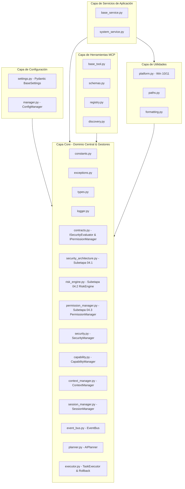

# Arquitectura Base de Jessyca Windows MCP

## Visión General

**Jessyca Windows MCP** está estructurada siguiendo la **Clean Architecture** de Robert C. Martin (Uncle Bob) y los principios de diseño orientados a objetos **SOLID**. La meta es garantizar una separación completa de responsabilidades, alta testabilidad y modularidad para permitir un crecimiento sostenible durante muchos años y escalar limpiamente para cientos de herramientas MCP.

---

## Capas de la Arquitectura

La regla fundamental de la Clean Architecture es la **Regla de Dependencia**: las dependencias en el código sólo pueden apuntar hacia adentro, hacia el núcleo de dominio (`core/`).

### 1. Capa `core/` (Núcleo de Dominio y Subsystems)
- **Modelos y Contratos**: Modelos conceptuales, abstracciones, interfaces base (Protocols/ABCs), constantes globales, tipos compartidos y excepciones.
- **Security Architecture Foundation (`security_architecture.py` - Subetapa 04.1)**: Definición de modelos de dominio de seguridad (`SecurityContext`, `ToolSecurityMetadata`, `SecurityRequest`, `SecurityDecision`, `SecurityResult`), niveles (`SecurityLevel`), tipos de decisión (`SecurityDecisionType`) e interfaz `ISecurityEvaluator`.
- **Risk Engine (`risk_engine.py` - Subetapa 04.2)**: Motor determinista desacoplado de evaluación de riesgo (`RiskEngine` & `IRiskEvaluator`) que mapea la jerarquía `SAFE < WARNING < DANGEROUS < CRITICAL` y factores `RiskFactor`.
- **Permission Manager (`permission_manager.py` - Subetapa 04.3)**: Componente desacoplado de autorización (`PermissionManager` & `IPermissionManager`) que evalúa si una operación está autorizada (`ALLOW`, `DENY`, `REQUIRE_CONFIRMATION`, `ALLOW_ONCE`, `ALWAYS_ALLOW`) aplicando Fail-Safe `DEFAULT DENY`.
- **SecurityManager (`security.py`)**: Control de acceso basado en listas blancas/negras, permisos y auditoría inmutable.
- **CapabilityManager (`capability.py`)**: Desacopla la resolución de herramientas por capacidad declarada (ej. `Filesystem.copy`) y alias alternativos.
- **ContextManager (`context_manager.py`)**: Estado temporal del escritorio y sesión (ventana activa, archivo actual, último OCR) con TTL opcional, independiente del LLM.
- **SessionManager (`session_manager.py`)**: Seguimiento inmutable del ciclo de vida de sesiones, herramientas ejecutadas y exportación JSON/Markdown.
- **EventBus (`event_bus.py`)**: Bus de eventos asíncrono con prioridades (`HIGHEST` a `LOW`), listeners múltiples y tolerancia a fallos.
- **AIPlanner (`planner.py`)**: Generación de planes de ejecución estructurados (`ExecutionPlan`) en lenguaje natural sin ejecutar herramientas.
- **TaskExecutor (`executor.py`)**: Ejecución secuencial de planes con orden topológico de dependencias y motor de **Rollback compensatorio**.

### 2. Capa `config/` (Configuración)
- Carga y valida variables de entorno utilizando `pydantic-settings` v2.
- Implementa el patrón Singleton `ConfigManager` para recarga dinámica.

### 3. Capa `services/` (Servicios de Aplicación)
- Implementa la lógica de caso de uso (ej. diagnósticos de hardware, monitoreo de sistema).
- Implementa contratos `IService` con ciclo de vida explícito (`initialize()`, `shutdown()`).

### 4. Capa `tools/` (Catálogo y Autodescubrimiento de Herramientas MCP)
- Autodescubrimiento dinámico mediante escaneo de archivos (`registry.py` y `discovery.py`).
- Esquemas de especificación formal MCP (`schemas.py`) e interfaz base `BaseMCPTool`.

### 5. Capa `utils/` (Infraestructura y Utilidades de Plataforma)
- Utilidades para verificar la compatibilidad nativa con Windows 10 (Build >= 19041) y Windows 11, permisos de administrador, resolución de rutas y formateo de texto.

---

## Cumplimiento de Principios SOLID

1. **Single Responsibility Principle (SRP)**: Cada módulo tiene un único motivo de cambio.
2. **Open/Closed Principle (OCP)**: Se agregan herramientas automáticamente en `tools/` sin modificar el registro central.
3. **Liskov Substitution Principle (LSP)**: Todos los componentes heredan de contratos base respetando la interfaz.
4. **Interface Segregation Principle (ISP)**: Interfaces pequeñas y enfocadas (`IService`, `ITool`, `IToolRegistry`, `ISecurityEvaluator`, `IRiskEvaluator`, `IPermissionManager`).
5. **Dependency Inversion Principle (DIP)**: Inversión de dependencias basada en `core/contracts.py`.
