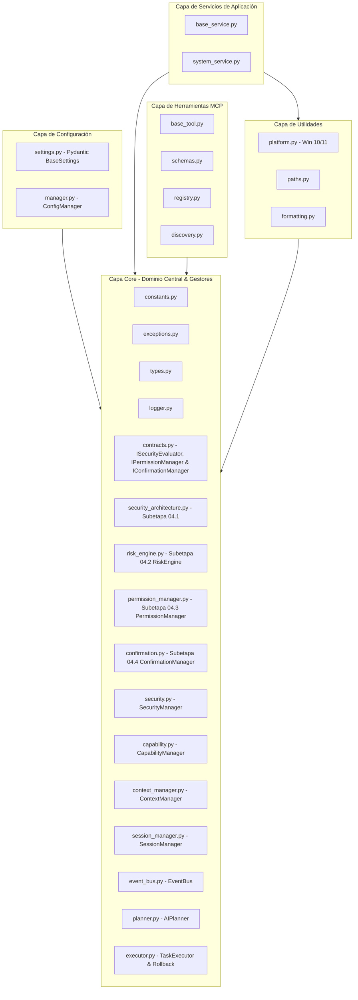

# Arquitectura Base de Jessyca Windows MCP

## Visión General

**Jessyca Windows MCP** está estructurada siguiendo la **Clean Architecture** de Robert C. Martin (Uncle Bob) y los principios de diseño orientados a objetos **SOLID**. La meta es garantizar una separación completa de responsabilidades, alta testabilidad y modularidad para permitir un crecimiento sostenible durante muchos años y escalar limpiamente para cientos de herramientas MCP.

---

## Capas de la Arquitectura

La regla fundamental de la Clean Architecture es la **Regla de Dependencia**: las dependencias en el código sólo pueden apuntar hacia adentro, hacia el núcleo de dominio (`core/`).

### 1. Capa `core/` (Núcleo de Dominio y Subsystems)
- **Modelos y Contratos**: Modelos conceptuales, abstracciones, interfaces base (Protocols/ABCs), constantes globales, tipos compartidos y excepciones.
- **Security Architecture Foundation (`security_architecture.py` - Subetapa 04.1)**: Definición de modelos de dominio de seguridad (`SecurityContext`, `ToolSecurityMetadata`, `SecurityRequest`, `SecurityDecision`, `SecurityResult`), niveles (`SecurityLevel`), tipos de decisión (`SecurityDecisionType`) e interfaz `ISecurityEvaluator`.
- **Risk Engine (`risk_engine.py` - Subetapa 04.2)**: Motor determinista desacoplado de evaluación de riesgo (`RiskEngine` & `IRiskEvaluator`) que mapea la jerarquía `SAFE < WARNING < DANGEROUS < CRITICAL` y factores `RiskFactor`.
- **Permission Manager (`permission_manager.py` - Subetapa 04.3)**: Componente desacoplado de autorización (`PermissionManager` & `IPermissionManager`) que evalúa si una operación está autorizada (`ALLOW`, `DENY`, `REQUIRE_CONFIRMATION`, `ALLOW_ONCE`, `ALWAYS_ALLOW`) aplicando Fail-Safe `DEFAULT DENY`.
- **Confirmation Manager (`confirmation.py` - Subetapa 04.4)**: Gestor desacoplado de confirmaciones (`ConfirmationManager`, `IConfirmationManager`, `IConfirmationProvider`) con binding de acción SHA-256 (`ActionFingerprint`), protección Replay, sanitización de datos sensibles y control de expiración.
- **Security Policy Engine (`security_policy.py` - Subetapa 04.5)**: Capa declarativa de políticas de seguridad (`SecurityPolicy`, `SecurityPolicyEvaluator`, `IPolicyEvaluator`, `IPolicyProvider`) con prioridades deterministas, estrategia DENY OVERRIDE, inmutabilidad y protección total contra auto-modificación por LLM.
- **Audit Logger (`audit_logger.py` - Subetapa 04.6)**: Subsistema de auditoría estructurada (`AuditLogger`, `AuditEvent`, `IAuditSink`, `FileAuditSink`, `MemoryAuditSink`) con sanitización previa de datos sensibles (`[REDACTED]`), formato JSON Lines (`.jsonl`), rotación por tamaño y modo de fallo `BEST_EFFORT`.
- **Security Audit & Adversarial Tests (`tests/security/` - Subetapa 04.7)**: Suite de pruebas de seguridad adversariales, matriz de seguridad en `docs/security_audit.md`, verificación formal de las 10 Invariantes de Seguridad y fuzzing controlado.
- **FastMCP Server Infrastructure (`server/` - Subetapa 05.1)**: Infraestructura del servidor MCP (`JessycaMCPServer`, `ServerLifecycleManager`, `RequestContext`, `HealthChecker`, `StubExecutionBoundary`) con aislamiento de entradas no confiables del cliente y frontera Stub no ejecutables.
- **Secure Execution Pipeline & Boundary (`server/` - Subetapa 05.2)**: Orquestador seguro de ejecución (`SecureExecutionPipeline`, `SecurityDecisionAggregator`, `AuthorizationEvidence`, `SecureExecutionBoundary`, `DisabledToolExecutor`) con validación de evidencia criptográfica SHA-256 e integración con Audit Logger y EventBus.
- **Capability System & Tool Registry Hardening (`core/capabilities.py`, `capability_registry.py`, `capability_validator.py`, `capability_resolver.py` - Subetapa 06.1)**: Capa declarativa inmutable de capacidades que define herramientas, operaciones, niveles de riesgo inherentes y fingerprints deterministas SHA-256.
- **Secure Filesystem Tools (`tools/filesystem/` - Subetapa 06.2)**: Primera implementación real segura de herramientas de Windows (`windows.files`) con aislamiento de Sandbox, Path Security Layer (anti-traversal, realpath canonicalization), escrituras atómicas y total orquestación por `SecureExecutionPipeline`.
- **Secure Process Management Tools (`tools/process/` - Subetapa 06.3)**: Inspección y gestión segura de procesos Windows (`windows.process`) con `psutil`, Protección de Procesos del Sistema Protegidos, Protección contra Reutilización de PID (PID Reuse Protection) y garantía de Cero Shell Execution.
- **Secure Windows Registry Tools (`tools/registry/` - Subetapa 06.4)**: Inspección exclusivamente READ-ONLY del Registro de Windows (`windows.registry`) con módulo nativo `winreg`, `RegistryPathSecurityManager` (hives autorizados HKCU/HKLM, límite de profundidad), Cero `reg.exe`/shell execution y backend desacoplado `IRegistryBackend`.
- **Secure Windows Services Tools (`tools/services/` - Subetapa 06.5)**: Inspección exclusivamente READ-ONLY de Servicios de Windows (`windows.services`) con `ServiceNameSecurityManager` (anti-command injection), Cero `sc.exe`/subprocess/shell execution y backend desacoplado `IWindowsServicesBackend`.
- **Command Policy & Allowlist Foundation (`core/command_policy.py` - Subetapa 07.1)**: Capa declarativa de evaluación de políticas de comandos y listas blancas (`CommandAllowlistRule`, `CommandPolicyManager`, `CommandRiskClassifier`, `ShellMetacharacterDetector`). Garantía de Cero Ejecución (Metadata-Only).
- **Secure Command & Argument Parser (`core/command_parser.py` - Subetapa 07.2)**: Tokenizador determinista y parser seguro (`SecureCommandParser`, `CommandLexer`, `CommandArgumentValidator`, `StructuredCommand`). Transformación a `[executable, arg1, arg2, ...]` con hash SHA-256 canónico. Garantía de Cero Ejecución (Text Analysis Only).
- **PowerShell & CMD Execution Boundary (`core/powershell_boundary.py`, `core/cmd_boundary.py` - Subetapa 07.3)**: Frontera de seguridad para PowerShell/CMD (`PowerShellExecutionBoundary`, `CMDExecutionBoundary`, `PowerShellInvocation`, `CMDInvocation`). Bloqueo de flags de bypass (`-EncodedCommand`, `-ExecutionPolicy Bypass`, `/c`, `/k`), obfuscación (`iex`, `Invoke-Expression`), imposición de `-NoProfile` / `-NonInteractive` y binding criptográfico SHA-256. Garantía de Cero Ejecución (Boundary Validation Only).
- **Command Output Security, Redaction & Sanitization (`core/command_output.py` - Subetapa 07.5)**: Capa de sanitización y redacción de salida (`CommandOutputSanitizer`, `SecretRedactor`, `SanitizedCommandOutput`). Eliminación de secuencias ANSI, normalización UTF-8, redacción de contraseñas/tokens/private keys/connection strings y truncamiento acotado. Garantía de Invariante: RAW OUTPUT NEVER LEAKS TO EXTERNAL SURFACES.
- **Command Audit & Adversarial Security Testing (`core/command_audit.py` - Subetapa 07.6)**: Gestor de auditoría unificada (`CommandAuditManager`), prevención de alteración post-autorización (anti-tampering), verificación formal de 15 invariantes de seguridad y suite end-to-end de pruebas adversariales para la Etapa 07.
- **Desktop Vision Foundation & Screen Capture (`tools/desktop/` - Subetapa 08.1)**: Infraestructura segura de capturas de pantalla (`windows.desktop` -> `take_screenshot`). Backend desacoplado (`WindowsDesktopCaptureBackend`, `FakeDesktopCaptureBackend`), validador estricto `DesktopSecurityManager` (FAIL-SAFE DENY) y registro de metadatos exclusivamente en auditoría (Invariante de Privacidad: CERO datos binarios de imagen en logs).
- **OCR Text Extraction Engine (`tools/desktop/` - Subetapa 08.2)**: Motor seguro de extracción OCR de texto (`windows.desktop` -> `ocr_screen`). Bounding boxes (`OCRBoundingBox`), regiones (`OCRTextRegion`), sanitización de texto y redacción de secretos (`OCRTextSanitizer`), validador de límites `OCRSecurityManager` (NaN/Infinity protection) y auditoría sanitizada sin texto crudo sensible.
- **UI Element Bounding Box & Visual Element Inspector (`tools/desktop/` - Subetapa 08.3)**: Inspección visual en modo solo lectura (READ-ONLY) de elementos UI y ventanas (`windows.desktop` -> `inspect_ui_element`, `get_active_window`, `list_windows`). Modelos inmutables (`WindowInfo`, `DetectedUIElement`, `UIElementTree`), fingerprinting de estado (`state_hash` SHA-256), backends desacoplados (`WindowsUIAutomationBackend`, `FakeUIInspectionBackend`) y validador `UIInspectionSecurityManager` (FAIL-SAFE DENY).
- **Secure Desktop Automation Boundary (`tools/desktop/` & `core/emergency_stop.py` - Subetapa 08.4)**: Frontera de seguridad y automatización interactiva del escritorio (`windows.desktop` -> `click_element`, `type_text`, `focus_window`, `drag_and_drop`). Subsistema independiente de Parada de Emergencia / Fail-Safe (`EmergencyStopManager`, `EmergencyStopState`, `CancellationToken`, `IEmergencyStopController`), comprobación por fases (validación, ejecución, espera, verificación), idoneidad de doble STOP thread-safe y protección contra targets obsoletos (`StaleTargetError`). **Cierre oficial de la ETAPA 08 — DESKTOP AUTOMATION, VISION & OCR SYSTEM.**
- **Network Interfaces & Adapter Inspection (`tools/network/` - Subetapa 09.1)**: Inspección de diagnóstico en modo solo lectura (READ-ONLY) de adaptadores e interfaces de red (`windows.network` -> `get_network_interfaces`). Modelos inmutables (`NetworkInterface`, `NetworkIPAddress`), backend desacoplado (`WindowsNetworkInspectionBackend`, `FakeNetworkInspectionBackend`), validador `NetworkSecurityManager` (FAIL-SAFE DENY) y registro de auditoría con metadatos exclusivos (Invariante de Privacidad: CERO direcciones IP/MAC crudas en logs). Inicio oficial de la ETAPA 09.
- **Active Network Connections & Port Listener Inspector (`tools/network/` - Subetapa 09.2)**: Inspección de diagnóstico en modo solo lectura (READ-ONLY) de conexiones TCP/UDP activas y puertos en escucha (`windows.network` -> `get_active_connections`, `get_listening_ports`). Modelos inmutables (`ActiveNetworkConnection`, `ListeningPort`, `NetworkEndpoint`), backend desacoplado (`WindowsNetworkConnectionInspectionBackend`, `FakeNetworkConnectionInspectionBackend`), sanitizador de procesos y frontera `NetworkConnectionSecurityManager` (FAIL-SAFE DENY).
- **System Routing Table & DNS Cache Inspector (`tools/network/` - Subetapa 09.3)**: Inspección de diagnóstico en modo solo lectura (READ-ONLY) de la tabla de ruteo IP y caché DNS local (`windows.network` -> `get_routing_table`, `get_dns_cache`). Modelos inmutables (`NetworkRoute`, `DNSCacheEntry`), backends desacoplados (`WindowsRoutingTableInspectionBackend`, `WindowsDNSCacheInspectionBackend`, `FakeRoutingTableInspectionBackend`, `FakeDNSCacheInspectionBackend`), sanitizador de hostnames y frontera `NetworkRoutingSecurityManager` (FAIL-SAFE DENY).
- **Secure Network & System Diagnostics Boundary Consolidation (`core/network_boundary_security.py` & `tools/network/` - Subetapa 09.4)**: Consolidador centralizado de la frontera de seguridad `NetworkBoundaryConsolidator` para las 5 operaciones del dominio `windows.network`. Auditoría de código fuente recursiva (CERO shell execution), verificación formal de 20 invariantes globales, enforzamiento estricto del pipeline y privacidad de auditoría con metadatos exclusivos. **Cierre oficial de la ETAPA 09 — SECURE NETWORK & SYSTEM DIAGNOSTICS.**
- **Session State & Persistent Memory Foundation (`core/session_*.py` - Subetapa 10.1)**: Capa de memoria y estado de sesión inmutable para Jessyca 3.0. Modelos congelados (`SessionState`, `SessionMessage`, `SessionFact`, `SessionPreference`, `SessionSnapshot`), validador `SessionSecurityManager` (con `SecretRedactor` e invariante de UNTRUSTED MEMORY DATA), almacenes desacoplados `InMemorySessionStore` y `SQLiteSessionStore` (thread-safe RLock), y orquestador de ciclo de vida `SessionManager`. CERO capacidad de ejecución de herramientas. **Inicio oficial de la ETAPA 10 — JESSYCA VIRTUAL ASSISTANT & AGENTIC WORKFLOW ORCHESTRATION.**
- **Context Builder & Memory Retrieval Engine (`core/context_*.py` & `memory_retriever.py` - Subetapa 10.2)**: Motor determinista de recuperación de memoria y construcción de contexto inmutable (`ContextSnapshot`, `ContextQuery`, `ContextSection`, `ContextItem`). Validador `ContextSecurityManager` (resistencia a Prompt-Injection, `SecretRedactor`, límites acotados), recuperadores `SessionMemoryRetriever` / `FakeMemoryRetriever` y orquestador `ContextBuilder` con auditoría con metadatos exclusivos. CERO capacidad de ejecución de herramientas o comandos del sistema.
- **Application Control Boundary (`core/application_*.py` - Subetapa 11.1)**: Capa genérica desacoplada de control de aplicaciones (`windows.application`). Modelos inmutables (`ApplicationState`, `ApplicationDescriptor`, `ApplicationSession`), adaptadores desacoplados (`WindowsApplicationAdapter`, `FakeApplicationAdapter`), gestor `ApplicationSessionManager` con política de **Single-Instance Enforcement** por defecto (`APPLICATION_SINGLE_INSTANCE_ENFORCED=True`) para prevención de apertura duplicada de ejecutables (resuelve Bug #1) y frontera de seguridad `ApplicationControlBoundary`.
- **Browser Control Boundary & Session Manager (`core/browser_*.py` - Subetapa 11.2)**: Capa de control estructurado de navegador web sobre Application Control (`windows.browser`). Modelos inmutables (`BrowserDescriptor`, `BrowserSession`, `BrowserTab`, `MediaState`), política `URLAllowlistPolicy` Deny-by-Default (bloqueo de esquemas peligrosos `javascript:`, `file:`, `data:` y dominios no autorizados `BROWSER_ALLOWED_DOMAINS`), motor de consulta estructurada del DOM (`DOMQueryEngine`) sin depender de coordenadas visuales, sincronizador por condiciones `PageStateWaiter`, registro cerrado de snippets de JavaScript `AllowedJSSnippet` (prohibición absoluta de ejecuciones de JS libre), controlador `MediaPlaybackController` con verificación real post-acción (**resuelve Bug #2 - Autoplay/Playable de YouTube**) y frontera de seguridad `BrowserControlBoundary`. Cierre oficial de la ETAPA 11.2.
- **Media Playback, System Audio & Clipboard Control Boundary (`core/media_control.py`, `core/system_audio.py`, `core/clipboard_security.py` - Subetapa 11.3)**: Tubería verificable de reproducción multimedia (`MediaPlaybackController` con el flujo obligatorio `inspect -> attempt -> wait -> inspect -> verify` y detección de `MEDIA_BLOCKED` por política de Autoplay, **resolviendo definitivamente el Bug original de YouTube**), controlador desacoplado de audio del sistema (`SystemAudioController` para volumen, mute y dispositivos de salida), y frontera de seguridad para el portapapeles (`ClipboardSecurityManager`) que enforza tratamiento como `UNTRUSTED DATA`, límite estricto de tamaño (`CLIPBOARD_MAX_SIZE=64KB`), política global de activación (`CLIPBOARD_ENABLED`), sanitización de secretos con `OCRTextSanitizer` y auditoría con metadatos exclusivamente. Cierre oficial de la ETAPA 11.3.
- **Document Generation Bridge (`core/document_bridge.py` - Subetapa 11.4)**: Puente de generación segura de documentos (`windows.files.generate_document`). Reutiliza `PathSecurityManager` para canonicalización y restricción estricta dentro de `FILESYSTEM_SANDBOX_ROOT`, rechazo automático de fugas de sandbox o Path Traversal (`../`), límite máximo de tamaño de salida (10 MB), generadores desacoplados (`NativeDocumentGenerator`, `FakeDocumentGenerator`), autorización por `SecureExecutionPipeline` y auditoría con metadatos exclusivamente. Cierre oficial de la ETAPA 11.4.
- **Local Vector Store Foundation (`core/vector_store_models.py`, `core/local_vector_store.py` - Subetapa 12.1)**: Almacén vectorial local determinista (`LocalVectorStore`) y generador de embeddings de 384 dimensiones 100% local (`LocalEmbeddingProvider`). Implementa ranking por similitud de coseno, recuperador `SemanticMemoryRetriever` con la invariante fundamental **MEMORY = EVIDENCE, MEMORY != AUTHORITY** (cero capacidad de conceder permisos o alterar decisiones de seguridad), sanitización previa de secretos con `OCRTextSanitizer` y límites estrictos de capacidad (`VECTOR_STORE_MAX_DOCUMENTS=10000`). Inicio oficial de la **ETAPA 12 — LONG-TERM SEMANTIC MEMORY.**
- **Autonomy Level Model & Policy (`core/autonomy_policy.py` - Subetapa 16.1)**: Modelo formal de niveles de autonomía del agente (`AutonomyLevel` del 0 al 4: `LEVEL_0_OBSERVE` a `LEVEL_4_CONTROLLED_AUTONOMY`) y evaluador determinista `AutonomyPolicy`. Enforza la **REGLA DE NO AUTORIDAD**: Ningún componente (LLM, Memoria, Plugin, Scheduler, Workflow) puede autoelevar su propio nivel de autonomía ni modificar las decisiones de seguridad de `RiskEngine` o `PermissionManager`. Cierre oficial de la remedación de seguridad de la Etapa 16.
- **Multi-LLM Foundation Layer (`core/llm/` - Fase 1)**: Capa desacoplada e independiente de inferencia LLM. Modelos declarativos e inmutables (`ModelProfile`), catálogo centralizado en memoria (`ModelRegistry` con 5 modelos registrados: `llama3.2`, `llama3.1`, `qwen3:8b`, `qwen3-vl:4b`, `gemma4:e4b`), administrador de selección explícita (`ModelManager`), abstracción de inferencia (`LLMProvider`) con implementación concreta (`OllamaProvider`) y stub para pruebas (`FakeLLMProvider`). CERO acoplamiento directo a llamadas ad-hoc de Ollama en el core de la aplicación.
- **SecurityManager (`security.py`)**: Control de acceso basado en listas blancas/negras, permisos y auditoría inmutable.
- **CapabilityManager (`capability.py`)**: Desacopla la resolución de herramientas por capacidad declarada (ej. `Filesystem.copy`) y alias alternativos.
- **ContextManager (`context_manager.py`)**: Estado temporal del escritorio y sesión (ventana activa, archivo actual, último OCR) con TTL opcional, independiente del LLM.
- **SessionManager (`session_manager.py`)**: Seguimiento inmutable del ciclo de vida de sesiones, herramientas ejecutadas y exportación JSON/Markdown.
- **EventBus (`event_bus.py`)**: Bus de eventos asíncrono con prioridades (`HIGHEST` a `LOW`), listeners múltiples y tolerancia a fallos.
- **AIPlanner (`planner.py`)**: Generación de planes de ejecución estructurados (`ExecutionPlan`) en lenguaje natural sin ejecutar herramientas.
- **TaskExecutor (`executor.py`)**: Ejecución secuencial de planes con orden topológico de dependencias y motor de **Rollback compensatorio**.

### 2. Capa `config/` (Configuración)
- Carga y valida variables de entorno utilizando `pydantic-settings` v2.
- Implementa el patrón Singleton `ConfigManager` para recarga dinámica.

### 3. Capa `services/` (Servicios de Aplicación)
- Implementa la lógica de caso de uso (ej. diagnósticos de hardware, monitoreo de sistema).
- Implementa contratos `IService` con ciclo de vida explícito (`initialize()`, `shutdown()`).

### 4. Capa `tools/` (Catálogo y Autodescubrimiento de Herramientas MCP)
- Autodescubrimiento dinámico mediante escaneo de archivos (`registry.py` y `discovery.py`).
- Esquemas de especificación formal MCP (`schemas.py`) e interfaz base `BaseMCPTool`.

### 5. Capa `utils/` (Infraestructura y Utilidades de Plataforma)
- Utilidades para verificar la compatibilidad nativa con Windows 10 (Build >= 19041) y Windows 11, permisos de administrador, resolución de rutas y formateo de texto.

---

## Cumplimiento de Principios SOLID

1. **Single Responsibility Principle (SRP)**: Cada módulo tiene un único motivo de cambio.
2. **Open/Closed Principle (OCP)**: Se agregan herramientas automáticamente en `tools/` sin modificar el registro central.
3. **Liskov Substitution Principle (LSP)**: Todos los componentes heredan de contratos base respetando la interfaz.
4. **Interface Segregation Principle (ISP)**: Interfaces pequeñas y enfocadas (`IService`, `ITool`, `IToolRegistry`, `ISecurityEvaluator`, `IRiskEvaluator`, `IPermissionManager`, `IConfirmationManager`, `IConfirmationProvider`).
5. **Dependency Inversion Principle (DIP)**: Inversión de dependencias basada en `core/contracts.py`.
