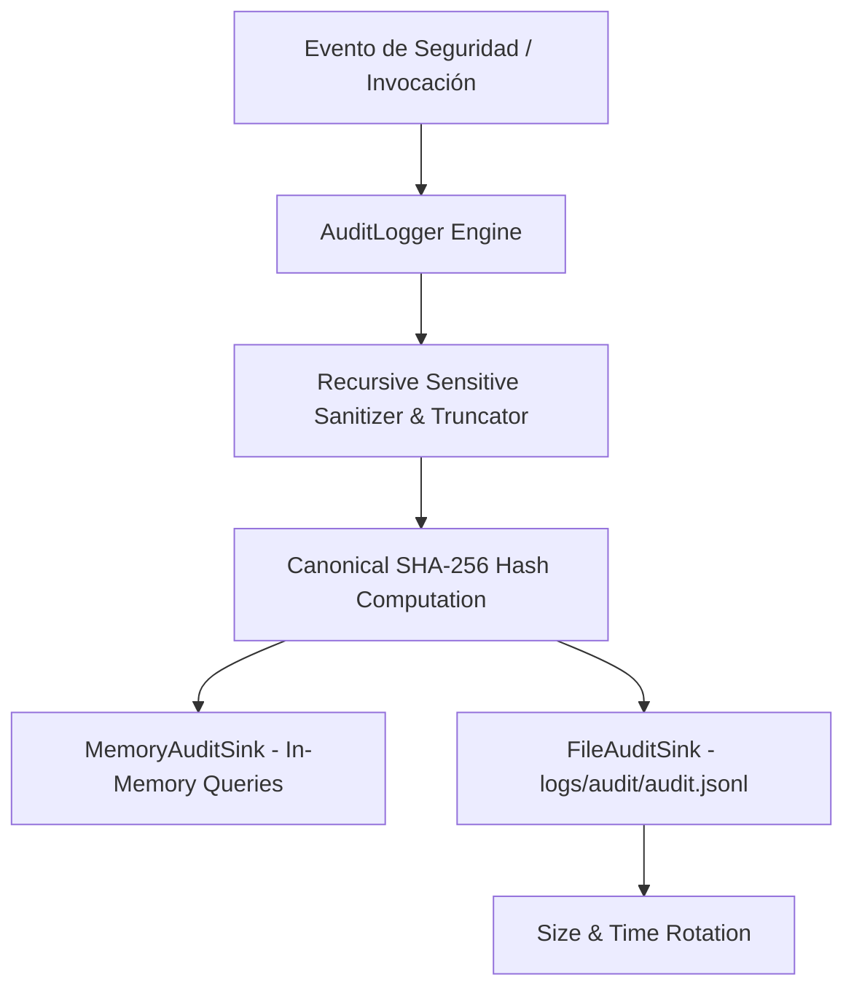

# Subsistema de Auditoría de Seguridad - Jessyca Windows MCP (Subetapa 04.6)

## Propósito

El **Audit Logger** de **Jessyca Windows MCP** proporciona un registro estructurado, inmutable, seguro y auditable para la reconstrucción completa del ciclo de vida de cualquier operación solicitada por el usuario o modelos de lenguaje (LLM).

Permite responder deterministamente:
- **¿Quién?**: Usuario o cuenta solicitante (`user`).
- **¿Qué herramienta y operación?**: `tool_name` y `operation`.
- **¿Con qué parámetros?**: Parámetros de entrada de la herramienta (sanitizados previamente).
- **¿Qué riesgo?**: Nivel de riesgo asignado por el `RiskEngine` (`security_level` y `risk_factors`).
- **¿Qué política?**: Política de seguridad evaluada (`policy_id`, `version`, `source`).
- **¿Qué permiso y confirmación?**: Decisión de autorización (`permission_decision`) y estado de confirmación (`confirmation_status`).
- **¿Resultado y duración?**: `success`, `duration_ms`, `error_code`, `error_message`.
- **¿Cuándo?**: Timestamp preciso en UTC (`timestamp`).

---

## Arquitectura y Componentes

### 1. Modelo de Evento (`AuditEvent`)
Contenedor estructurado con 24 campos de trazabilidad:
- `event_id`: Identificador único UUID por evento.
- `timestamp`: Timestamp ISO 8601 en UTC.
- `event_type`: Tipo de evento (`AuditEventType`).
- `session_id`: Identificador de sesión de Jessyca.
- `correlation_id`: Identificador de grupo de operaciones correlacionadas.
- `request_id`: Identificador único de solicitud.
- `user`, `tool_name`, `operation`, `parameters`.
- `security_level`, `risk_factors`.
- `policy_id`, `policy_version`, `policy_source`, `policy_decision`.
- `permission_decision`, `confirmation_status`, `requires_elevation`.
- `success`, `reason`, `error_code`, `error_message`, `duration_ms`, `metadata`.
- `event_hash`: Hash canónico SHA-256 del evento sanitizado.

### 2. Sanitización Recursiva de Datos Sensibles
Antes de persistir o emitir cualquier evento, el sanitizador analiza recursivamente estructuras de datos (`dict`, `list`, `tuple`, `set`, objetos anidados) y enmascara cualquier campo cuyo nombre coincida con patrones sensibles (`password`, `token`, `api_key`, `secret`, `credential`, `authorization`, `cookie`, `private_key`, `auth`) reemplazando su contenido por `"[REDACTED]"`.

### 3. Truncamiento de Parámetros y Mensajes
Cadenas de texto que exceden la longitud máxima configurada (ej. 1000 caracteres) son truncadas automáticamente adjuntando el indicador `"[TRUNCATED]"`.

### 4. Sinks Desacoplados (`IAuditSink`)
- **`MemoryAuditSink`**: Almacenamiento seguro en memoria con cerrojo de hilos (`threading.Lock`) para pruebas y búsquedas rápidas.
- **`FileAuditSink`**: Escritura atómica en disco en formato **JSON Lines (`.jsonl`)** en `logs/audit/audit.jsonl`. Un objeto JSON válido por línea.

### 5. Rotación de Archivos de Auditoría
El `FileAuditSink` gestiona rotación por tamaño (`AUDIT_MAX_FILE_SIZE`, por defecto 10 MB) conservando una cantidad configurable de backups (`AUDIT_BACKUP_COUNT`, por defecto 5 archivos rotados: `audit.jsonl.1`, `audit.jsonl.2`, etc.).

### 6. Modos de Fallo (`AuditFailureMode`)
- **`BEST_EFFORT`** (Predeterminado): Si la persistencia de auditoría falla (ej. disco lleno), el error es registrado en los logs de diagnóstico del sistema pero **NO** altera la decisión de seguridad ni interrumpe la aplicación.
- **`FAIL_CLOSED`**: Exige la persistencia exitosa de la auditoría antes de autorizar o continuar operaciones.

---

## Principio de Seguridad Crítico

> [!IMPORTANT]
> El **Audit Logger** es un componente de trazabilidad puro.
> - **NO** ejecuta herramientas MCP ni comandos del SO.
> - **NO** modifica el registro o archivos de Windows.
> - **NO** altera ni muta las reglas de `SecurityPolicy`.
> - **NO** decide permisos ni altera las evaluaciones de `PermissionManager`.
