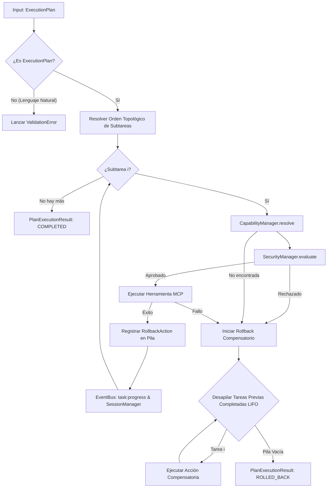

# Arquitectura del Task Executor & Motor de Rollback

Este documento describe la arquitectura, flujo de resolución de dependencias, eventos de progreso y mecanismo de **Rollback compensatorio** del **Task Executor** (`core/executor.py`) en **Jessyca Windows MCP**.

---

## 1. Reglas Fundamentales de Ejecución

> [!IMPORTANT]
> 1. **Entrada Exclusiva**: El `TaskExecutor` **acepta exclusivamente un `ExecutionPlan`** (o su JSON). Rechaza cualquier intento de pasar texto libre en lenguaje natural con una excepción `ValidationError`.
> 2. **Desacoplamiento Absoluto de Herramientas**: La selección de herramientas se realiza mediante la resolución de capacidades (`CapabilityManager.resolve(capability, action)` o `resolve_by_alias(alias)`). Jamás se invocan nombres estáticos o rutas concretas de clases.
> 3. **Seguridad Integrada**: Cada subtarea es evaluada por el `SecurityManager` antes de proceder.
> 4. **Motor de Rollback Compensatorio**: Si una subtarea falla a mitad del plan, las acciones compensatorias previas se desapilan y ejecutan en orden inverso (LIFO).

---

## 2. Flujo de Ejecución y Rollback



---

## 3. Ejemplo de Uso

```python
import asyncio
from core.planner import AIPlanner
from core.executor import TaskExecutor
from core.capability import CapabilityManager, ToolCapabilitySpec
from tools.base_tool import BaseMCPTool

# 1. Definir herramienta de prueba
class HealthTool(BaseMCPTool):
    def __init__(self):
        super().__init__(name="health_tool", description="Diagnostico", capability="System", action="health")
    def _get_input_schema(self): return {"type": "object", "properties": {}}
    async def _execute_internal(self, arguments): return {"status": "ok"}

async def main():
    # 2. Configurar CapabilityManager y registrar herramienta
    cap_mgr = CapabilityManager()
    tool = HealthTool()
    cap_mgr.register_tool_capability(tool, ToolCapabilitySpec("System", "health"))

    # 3. Generar Plan desde AIPlanner
    planner = AIPlanner()
    plan = planner.create_plan("Obtener salud del sistema")

    # 4. Instanciar TaskExecutor y ejecutar el Plan
    executor = TaskExecutor(capability_manager=cap_mgr)
    result = await executor.execute_plan(plan)

    print(f"Estado del Plan: {result.status}")
    print(f"Progreso: {result.progress_percent}%")
    print(f"Salidas: {result.task_outputs}")

asyncio.run(main())
```
